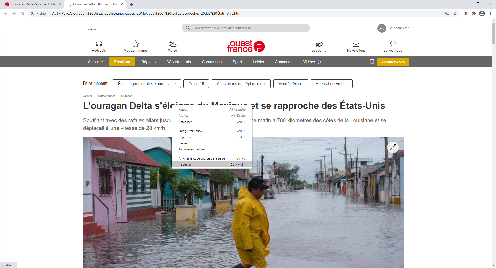
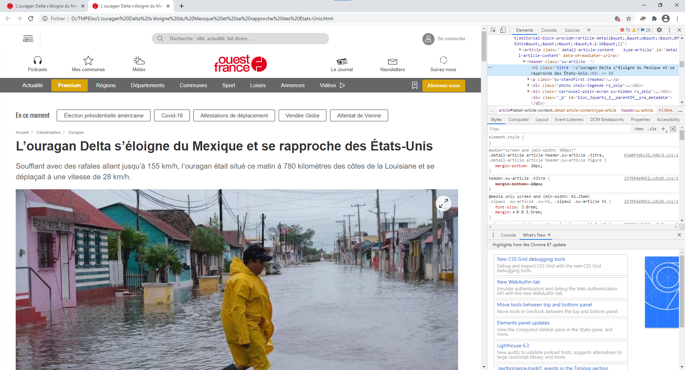
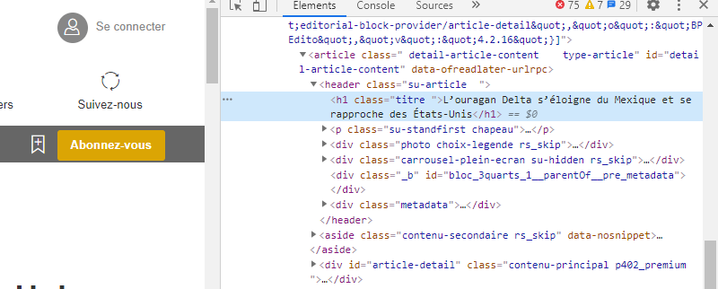
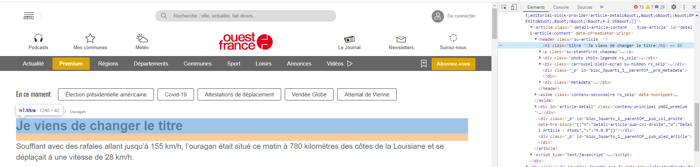

# Modifier une page web (et en faire une fake news)

### Sommaire :

* [Les prérequis](https://github.com/lapingenieur/SNT/blob/master/chapitre_5/fakenews/README.md#pr%C3%A9requis)
  * [Comment sauvegarder le site une première fois](https://github.com/lapingenieur/SNT/blob/master/chapitre_5/fakenews/README.md#sauvergarder-le-site-une-premi%C3%A8re-fois)
  * [Ouvrir la page (locale)](https://github.com/lapingenieur/SNT/blob/master/chapitre_5/fakenews/README.md#ouvrir-la-page-locale)
* [Comment modifier un élément de la page web](https://github.com/lapingenieur/SNT/blob/master/chapitre_5/fakenews/README.md#modifier-un-%C3%A9l%C3%A9ment-de-la-page)
  * [Ouvrir « l'inspecteur »](https://github.com/lapingenieur/SNT/blob/master/chapitre_5/fakenews/README.md#ouvrir-linspecteur)
  * [Comment changer du texte](https://github.com/lapingenieur/SNT/blob/master/chapitre_5/fakenews/README.md#changer-du-texte)
  * [Enregistrer le travail](https://github.com/lapingenieur/SNT/blob/master/chapitre_5/fakenews/README.md#enregistrer-les-modifs)
* [Quelques infos en plus](https://github.com/lapingenieur/SNT/blob/master/chapitre_5/fakenews/README.md#infos-suppl%C3%A9mentaires)

## Prérequis

* google chrome (version ordinateur)
* un site internet pour la fake news. Por l'exemple on prendra [celui-ci](https://www.ouest-france.fr/catastrophes/ouragan/l-ouragan-delta-s-eloigne-du-mexique-et-se-rapproche-des-etats-unis-7006129). (ne le reprenez pas c'est ce que j'ai fais ^^)

> 
> 
> Le site de l'exemple.

### Sauvergarder le site une première fois

Il suffit de cliquer *droit* n'importe où sur la page et de sélectionner `Enregistrer sous...`. Là vous enregistrez la page quelque part sur votre ordi (c'est possible que ça vous enregistre d'autres fichiers aussi, ___c'est normal___) :

### Ouvrir la page **locale**

1. Il faut d'abord aller dans le dossier où se trouve la page téléchargée
2. Ensuite il faut ouvrir la page avec *google chrome* : (dans mon exemple, il y a un fichier et un dossier pour cette page web)
  * clic droit sur le fichier de **type** `.html`
  * choisir `Ouvrir avec`
  * choisir le choix qui contient `google chrome`

Une page avec le site web devrait s'afficher dans google chrome. Si la page s'afficher mal (*vraiment* mal), il vaut mieux prendre un autre site...

## Modifier un élément de la page

### Ouvrir l'*inspecteur*

Pour changer un élément (= une partie) de la page, il faut :

1. faire un clic droit sur la partie à modifier (par ex. le titre : "L’ouragan Delta s’éloigne" etc)
2. choisir `Inspecter` (voir image dessous)

=> Un volet s'ouvre à droite (ou ailleurs) dans google chrome : c'est l'inspecteur. Il permet de modifier la page "en direct". Il est coupé en trois parties :

* En haut, avec le texte "Elements" souligné en ici bleu. C'est le code source de la page rendu plus lisible. C'est de ça qu'on aura le plus besoin.
* Au milieu, il y a un éditeur de style. On n'en l'utilise pas là.
* En bas, la console et les nouveautés. Pareil, cette partie nous on s'en fiche.

> INFO: quand vous passez la souris sur un élément dans l'inspecteur, l'élément est surligné sur la page même, c'est partique pour trouver les éléments.

> Vous pouvez redimensionner les différentes parties du volet pour mieux voir de la même façon qu'on redimensionne une fenêtre dans windows

### Changer du texte

La partie sélectionnée par l'inspecteur est sur fond gris ou bleu. Puisqu'on a cliqué directement sur l'élément qu'on veut modifier, l'inspecteur le sélectionne automatiquement :

Dans un fichier `.html`, le texte est prèsque **toujours** entre les signes `>` et `<`. Ici, le titre ("L’ouragan Delta s’éloigne" etc) est bien présent dans le code. Pour le changer, il suffit de double cliquer **sur le texte**, faire la modif, puis appuyer sur la touche `Entrée`.

Ca marche pareil pour le texte en parapraphe. Le seul truc un peu spécial, c'est que vous ne **pouvez pas aller à la ligne juste en appuyant sur `Entrée`** : il vaut mieux ne pas essayer et juste suivre l'article original.

### Enregistrer les modifs

Une fois quelques modifications faites, je vous conseille **fortement** d'enregistrer la page. C'est la même manip que celle plus haut, à savoir clic droit > `Enregistrer sous...`

> Vous pouvez chager le nom du fichier en l'enregistrant, ou même l'enregistrer à la place de l'ancienne version, mais **ne faites pas comme moi** et faites plusieurs sauvegardes pour ne pas tout perdre ^^ !

---

## Infos supplémentaires

Pour que le site marche bien, il lui faudra sûrement le dossier téléchargé en plus de la page même (si il y en a un bien sûr) : donc vous pouvez envoyer au prof le fichier `.html` *seul*, puis après avec son dossier (par ex. dans un autre message).

Demandez moi si vous avez des questions !
