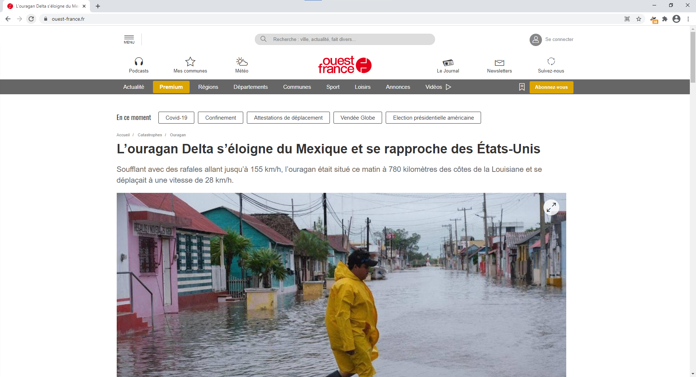

# Modifier une page web (et en faire une fake news)

### Sommaire :

## Prérequis

* google chrome (version ordinateur)
* un site internet pour la fake news. Por l'exemple on prendra [celui-ci](https://www.ouest-france.fr/catastrophes/ouragan/l-ouragan-delta-s-eloigne-du-mexique-et-se-rapproche-des-etats-unis-7006129). (ne le reprenez pas c'est ce que j'ai fais ^^)

---

> 
> 
> Le site de l'exemple.

### Sauvergarder le site une première fois

Il suffit de cliquer *droit* n'importe où sur la page et de sélectionner `Enregistrer sous...`. Là vous enregistrez la page quelque part sur votre ordi (c'est possible que ça vous enregistre d'autres fichiers aussi, ___c'est normal___).
