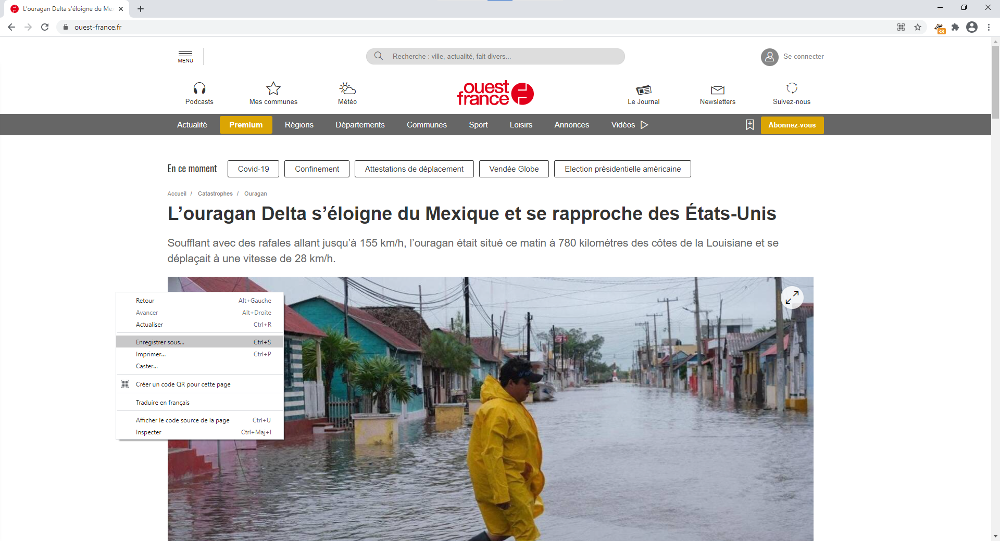
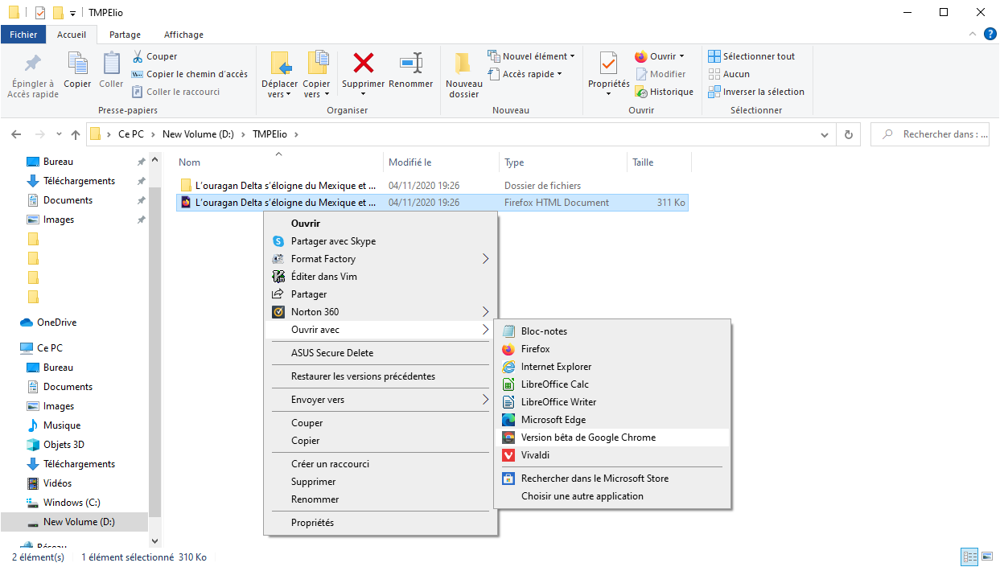

# Modifier une page web (et en faire une fake news)

### Sommaire :

## Prérequis

* google chrome (version ordinateur)
* un site internet pour la fake news. Por l'exemple on prendra [celui-ci](https://www.ouest-france.fr/catastrophes/ouragan/l-ouragan-delta-s-eloigne-du-mexique-et-se-rapproche-des-etats-unis-7006129). (ne le reprenez pas c'est ce que j'ai fais ^^)

> 
> 
> Le site de l'exemple.

### Sauvergarder le site une première fois

Il suffit de cliquer *droit* n'importe où sur la page et de sélectionner `Enregistrer sous...`. Là vous enregistrez la page quelque part sur votre ordi (c'est possible que ça vous enregistre d'autres fichiers aussi, ___c'est normal___) :

### Ouvrir la page **locale**

1. Il faut d'abord aller dans le dossier où se trouve la page téléchargée
2. Ensuite il faut ouvrir la page avec *google chrome* : (dans mon exemple, il y a un fichier et un dossier pour cette page web)
  * clic droit sur le fichier de **type** `.html`
  * choisir `Ouvrir avec`
  * choisir le choix qui contient `google chrome`

Une page avec le site web devrait s'afficher dans google chrome. Si la page s'afficher mal (*vraiment* mal), il vaut mieux prendre un autre site...
